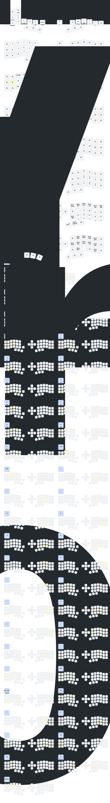

# dots-nt
man hope this fits on my tombstone

a monorepo config also monodocs

## styleNotes
i prefer plain text (i mean, almost).\
if you want to know why, check this piece: `https://ks4four.github.io/life/software/markdown/`

i only allow myself to use a few styles:\
use headings only as anchors, for external links.\
use `inline code block`s for in-app concepts, because sometimes app concepts aren't exactly the same as normal concepts (like `window`). also use them for bareURLs.\
use lowerCamelCase for out-of-app concepts (some are common sense).\
use soft line breaks to organize paragraphs.\
use preview links to show images.

## jwno
thinking about `modalEditing` in a `windowManager`... so that i don't need `workspaces` concept.\
trade-off: understand new "mode"s, with these keymaps

`jwno` is natively a manualTilingWindowManager.
the official example uses a stackBasedKeymap.
but i believe with enough janet, you can program it to behave however you want.\
trade-off: i used i3, niri, komorebi, glazeWM. i have to understand new concepts like `:frame` and `:window` (which means the behaviors of `:window` instand of the windows of softwares)

this config attempts to turn a `manualTiler` into a `modalEditing` mnemonic (not a real system), just like meow (`https://github.com/meow-edit/meow`) but for windows.\
trade-off: `modalEditing` here is just to help me remember and to attract people to look at this. actually, looking at the keymaps, it's pretty far from `meow`. originally i did introduce "i"/"I"/"a"/"A", but it seems less efficient than just using "i" followed by "h"/"j"/"k"/"l".

note that this config is 100 percent written by ai.
i literally didn't write a single character.\
trade-off: no warranty.

### meta
everything in this config assumes `:viewport` is enabled. all behaviors are designed around this. it is the infiniteCanvas: your monitor is just a camera looking at an infinite plane. you don't "switch workspace", you `:scroll-parent`. this is definitely not an alternative to `workspace`s concept.\
trade-off: unlike other designs. this is a matter of habit.

### why not `workspace`s
i have to admit, "workspace"s is a more robust concept. my reason is simple: my keyboard lacks a numrow, so i simply don't use them. actually, prompting the ai to implement `workspace`s logic that talks to yasb shouldn't be hard. after implementing this nonWorkspace approach, i realized that sticking to `workspace`s demands a specific mental loop: recall which `workspace` an app resides in, then press `mod` key + `#` numbers to switch. this fundamentally violates `selectFirstOperateLater`: you are forced to `operate` (context switch) before you can even `select` the target window.\

`workspace`s reminds me of `https://johnnydecimal.com/`, which uses numbers to manage files, just like using numbers to manage windows. you can assign semantics to numbers. but there is another school of thought that believes files fit `tagging` better, rather than hierarchy (`https://karl-voit.at/2020/01/25/avoid-complex-folder-hierarchies/`). `workspace`s enforces rigid categorization here. i struggled here for a while, eventually preferring `tagging`, and `jwno`'s jump `frame` functionality also helps me.

trade-off: part of the reason people use `workspace`s is because they can quickly jump to the desired `workspace`. and an infinite plane is actually hard to manage, far less simple than the linear thinking of `workspace`s.

### why arrows not "h"/"j"/"k"/"l" keys
i designed the inputs based on the nature of the operation. left/right arrow keys mean continuous values, while "h"/"j"/"k"/"l" keys is regarding windows. this bypasses the granularity conflict of using "h"/"j"/"k"/"l" keys for everything. for example, in `RESIZE`, `SCROLL`, and `ALPHA` modes, you can use "h"/"j"/"k"/"l" keys to change focus, then use arrow keys to `rapidFire` adjustments. i have a keyboard with a knob, but mapping clockwise/counter clockwise to "h" key and "l" key feels weird. left and right arrow keys don't have this issue. keymap also has logic regarding semantic modifiers. for example, "h"/"j"/"k"/"l" keys is always about `frame`s. keys with modifiers like "Ctrl" key + "h"/"j"/"k"/"l" key is `window`s.\
trade-off: for people using standard keyboards, arrow keys are actually very far from `homeRow`.

### why choose inspired by meow, not vim:
unlike standard `windowManagers` (and unlike `vim`'s `d2w` command), the logic here is selectFirstOperateLater. it's like meow/helix/kakoune. the idea is simple: since the window is always focused, naturally, this is a selection state. it fits `selectFirstOperateLater`, rather than vim's `verbThenNoun`.\
trade-off: in the end, the result is quite different from both. for heavy users of those tools, this isn't friendly.

### why "F23" key
actually, "F23" key is just personal preference. it can be totally substituted with any other key.\
trade-off: personal preference.

### why `:set-keymap` and not `:push-keymap` or why this keymap
in `jwno` documentation, these behave like `transientKeymaps`. in `zmk` terms, it's a `&toggle` layer. personally, managing multiple `&toggle` layers messes up my brain (too much cognitiveLoad), so i restrict `F23` as the sole `&toggle`. this way i only maintain one mental layer (another `zmk` concept: `https://zmk.dev/docs/keymaps/behaviors/layers`). no matter the current `mode`, pressing `F23` key instantly exits to `PASSTHROUGH`. that is the desired behavior. however, the real reason is that this config requires jumping between arbitrary `mode`s, and the ai seemed incapable of generating a working config using the stack-based `:push-keymap` logic, so i prompted the ai to use the imperative approach.\
trade-off: for someone just starting with `jwno`, this is extremely unfriendly. need to know a bit about keyboard layout design, `modalEditing`, `leaderKey`, the importance of `homeRow`, etc.

### why design jumping between different modes
so that i can operate applies immediately to the selection: in `RESIZE` or `ALPHA` modes, "h"/"j"/"k"/l keys (selection) and arrow keys (adjustment) can be pressed almost simultaneously.\
trade-off: although more flexible, real editor users might find this "goto" behavior unreasonable.

### (deprecated) why choose zebar `yasb`
`yasb` is needed to show `mode`s. also, visualising the depth calculation and the index of window-in-frame is quite necessary.\
trade-off: `yasb` uses `QSS`, styling is hard for `ai` to modify. currently switched to `zebar`.

### why choose zebar
just to make it easier for `ai` to write code.

### how to work with `yasb` or `zebar`
here we just use a temp file to do `interProcessCommunication`. current state is serialized to `jwno-status.json` in real-time, so external widgets (`yasb`) can render the ui reactively without polling. this coincidentally fits the unixPhilosophy: doOneThingAndDoItWell. the `jwno-status.json` file is just a string payload that looks like this: `{"mode":"PASSTHROUGH","viewport":0,"timestamp":1764702210,"depth":0,"window":{"position":0,"total":3},"frame":{"position":1,"total":2}}`.\
trade-off: using file IO has disk issues. the real solution is `socket`.

### why temp file
for this tool combination, the optimal solution might be a udp socket. but the ai kept trying to use `(import net)`, which is too complex for me since it requires recompiling the binary. simply concatenating a `json` string is obviously much easier.\
trade-off: not "clean", which i don't really care about.

### why jwno
here i will simply and subjectively compare my user experience across major `windowManager`s. note that no matter which `windowManager` i use, I won't use them for too long.

`jwno`:\
infinite plane, can set programmable `keymap`, sometimes not automatically organizing windows is indeed a bit annoying.

`komorebi`:\
infinite strip (enabled in nightly), guess it can also set programmable `keymap` (using `ahk`, defaults to `oneShotMod`). uses `workspace`s, as said before, i never really liked `ws`#.

`niri` (linux):\
infinite strip, `ws`#.

`i3` (linux):\
finite plane, `ws`#.

`paperWM`:\
infinite strip, unlike `ws`# above, uses an "upstairs/downstairs" relationship, rather than directly arranging semantic numeric `ws`#. this makes it so sometimes you have to walk three or four floors to get to where you want (most likely i just don't know how to use it).

## zmk
choosing `zmk` was just because `zmk` keyboards were cheaper and more diverse at the time, and wireless function was a bonus.

### keymap goals
priority sorted as follows:\
no thumb keys. (just pull the switch. implemented)\
only allow pressing two keys simultaneously. (not implemented yet, need to consider how to arrange combo `mod`s, or use `ahk` to script these combo `mod` operations)\
smooth one-handed operation. (currently no situations where i need to use keyboard suddenly while using mouse)\
finger responsibility zones must not be disturbed. (achievable as long as not using `verticalCombo`s)\
30 keys. (just pull the switch. implemented)

based on these goals, considered the following strategies.

#### QWERTY
i mean why not. it just types.

#### homeRowMods
enabled and necessary.

using `GACS`. since there are many variants, i won't discuss why other schemes failed (probably explained elsewhere). only explaining the left hand part below, because right hand part is not exactly the same as left hand part.

placing "Ctrl" key between "S" key and "F" key helps one-handed "Ctrl"+"S" and "Ctrl"+"F". especially "Ctrl"+"F", this is very useful for configs where mouse has thumb keys for copy/paste.\
trade-off: cannot press "Ctrl"+"c" and "Ctrl"+"v" one-handed. solved by mouse thumb keys.

"Alt" key placed to the left of "Ctrl" key. no special reason for this, just that `miryoku` used it, so i stuck with it. "Shift" key placed to the right of "Ctrl" key, same reason.

"LGui" key placed below "Ctrl" key. impossible to place to the left of "Alt" key. actually could design it below "Shift" key, but forgot which app needed which key causing me to switch back. anyway no particularly convincing reason.

#### keypad
enabled and necessary.

unlike `miryoku`, i don't use a single `keypad`, but fine-tune the position based on where fingers press. fine-tuning is unavoidable because no thumb keys.\
trade-off: multiple `layer`s make config unclean. but efficiency did go up a bit, whatever.

#### combos
enabled and necessary.

`delete` and `backspace` are the start of the whole config, and they are copied from `ARTSEY.io`. inspiration for other keys also came from `ARTSEY`, but i forgot.

adopting bottom row 12345 numbers because chinese input is necessary, and they are actually non-semantic. stuffing semantic ("i need to type numbers") and non-semantic ("i need to press numbers to type chinese") into one `numberLayer` is actually very unreasonable. as for right hand symbol `combo`s, they are completely symmetrical to left hand "Shift" key + numbers.

`combo`s above left hand `homeRow` copied from `miryoku`: "ESC" key, "TAB" key, "Space" key. placing colon in `combo` above right hand `homeRow` is just a `vim` habit, as for other symbols they are basically randomly arranged.

#### brackets
choose rolling instead of symmetry.

some symbols are paired. some people think they should be arranged in adjacent positions (rolling), some think placed on two halves of hands (symmetry).\
i use rolling, doing this is faster, and fits my one-handed operation better.

#### vertical combos
disabled.

although quite innovative, it disturbed my finger zones.

#### leader key (zmk)
disabled.

`leaderKey` is actually used for not-so-commonly used commands. different apps should have different `leaderKey` scopes. using it on keyboard feels forced.

i have a software (`ahk`) implemented `leaderKey`, then i define "F24" key on keyboard. i feel this is enough.

#### pointing devices (zmk)
disabled.

i feel typing isn't fast enough when using other `pointingDevices`. when needing 3 hours to write academic papers, they aren't faster than mouse.

#### one-shot mod
disabled.

primary reason is no thumb keys, secondly need 30 keys. remaining way out is writing a `modLayer`, but this is equivalent to using two keys to press one `mod`, violating the goal "only allow pressing two keys simultaneously". decided against it after ruling this out.

#### Keymap visualizing

